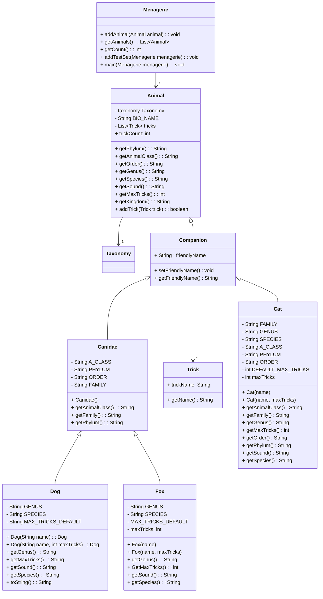

# Group 3 Design Document

## Animal

```mermaid
classDiagram
   class Animal
   class Canidae
   class Trick
   class Menagerie
   class Taxonomy
   class Dog
   class Fox
   class Cat
   
   Animal <|-- Companion
   Companion <|-- Cat
   Companion <|-- Canidae
   Canidae <|-- Dog
   Canidae <|-- Fox
   Animal  -->  "1" Taxonomy 
   Companion --> "*" Trick
   Menagerie --> "*" Animal

   class Companion {
      + String : friendlyName
      + setFriendlyName() void 
      + getFriendlyName() String
   }

   class Animal {
      - taxonomy Taxonomy
      - String BIO_NAME
      - List~Trick~ tricks
      + getPhylum(): String
      + getAnimalClass(): String
      + getOrder(): String
      + getGenus(): String
      + getSpecies(): String
      + getSound(): String
      + getMaxTricks(): int
      + getKingdom(): String
      + trickCount: int
      + addTrick(Trick trick): boolean 
   }
   class Trick {
      + trickName: String 
      + getName() String
   }

   class Canidae {
      - String A_CLASS
      - String PHYLUM
      - String ORDER
      - String FAMILY
      + Canidae()
      + getAnimalClass() : String
      + getFamily() : String
      + getPhylum() : String
      
   }
   
   class Fox {
      - String GENUS
      - String SPECIES
      - MAX_TRICKS_DEFAULT
      - maxTricks: int
      + Fox (name)
      + Fox (name, maxTricks)
      + getGenus() : String
      + GetMaxTricks(): int
      + getSound() : String
      + getSpecies() : String 
   }
   
   class Menagerie {
      + addAnimal(Animal animal) : void
      + getAnimals() : List~Animal~
      + getCount() : int
      + addTestSet(Menagerie menagerie) : void
      + main(Menagerie menagerie) : void
   }

   
   
   class Cat {
      - String FAMILY
      - String GENUS
      - String SPECIES
      - String A_CLASS
      - String PHYLUM
      - String ORDER
      - int DEFAULT_MAX_TRICKS
      - int maxTricks
      + Cat(name) 
      + Cat(name, maxTricks) 
      + getAnimalClass() String
      + getFamily() String
      + getGenus() String
      + getMaxTricks() int
      + getOrder() String
      + getPhylum() String
      + getSound() String
      + getSpecies() String
   }

   class Dog {
    - String GENUS
    - String SPECIES
    - String MAX_TRICKS_DEFAULT
    + Dog(String name) : Dog
    + Dog(String name, int maxTricks) : Dog
    + getGenus() : String
    + getMaxTricks() : String
    + getSound(): String
    + getSpecies() : String
    + toString() : String 
   }

```